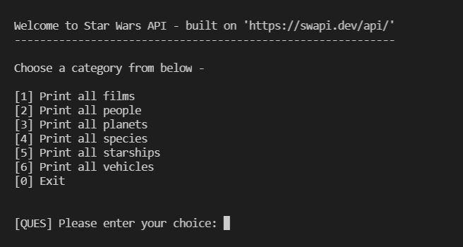

# Star Wars API

A simple command line menu-driven client for Star Wars API, aka SWAPI. See [here](https://swapi.dev/about) for information about the SWAPI.


## Dependencies

+ JDK version 1.7 or above

+ Maven 3.6.3 or above


## How to run

1. Clone the repository on your machine

2. Run the below command in the project directory
   
   ```bash
   $ mvn exec:java -Dexec.mainClass="com.example.App"
   ```


## Screenshots

+ Menu screenshot

   
